# Games101

这是学习GAMES101-现代计算机图形学入门课程的代码

课程网站： https://sites.cs.ucsb.edu/~lingqi/teaching/games101.html 

课程BBS：http://games-cn.org/forums/forum/graphics-intro/

主要内容：把课程代码重写到 windows 下

环境配置：

- Win10 + VS2019 + Eigen + opencv3.2
- 配置 IncludeDir、LibDir、Lib、DLL，opencv_world320d.dll 大小为60m+，无法上传
- 预处理：_CRT_SECURE_NO_WARNINGS

### A0: 环境配置

- 环境配置，熟悉 Eigen 库。


### A1：Matrix

- 设置 get_model_matrix() 。

- 设置 get_projection_matrix() ，n > 0, f > 0，并对 z 镜像，形成OpenGL系矩阵。

  ```c++
  // n > 0, f > 0
  //[ 2n/(r-l),    0,             0，          0，
  //    0，        2n/(t - b),    0,           0,
  //    0,         0,            (n+f)/(n-f),  2nf/(n-f),
  //    0,         0,             -1,         0]
  ```

- frame_buf 以左上角为原点，因为 opencv 从左上角读取，值域为（0, 255）。

- sample_buf 以以左上角为原点，值域为（0，1）。

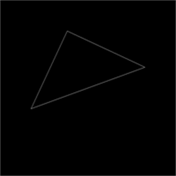

### A2：Z-Buffer，MSAA

- 实现 MSAA，维护以下三个 buf：

  ```c++
  frame_buf.resize(w * h);
  sample_buf.resize(4 * w * h);
  depth_buf.resize(4 * w * h);
  ```

  对每个 pixel 中的每个 sample，各自维护 color 与 depth。

  光栅化时对每个 pixel，遍历 4 个 sample，若发现 sample 被修改了，则重新计算 frame_buf。

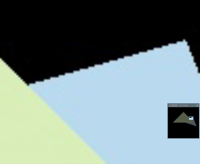

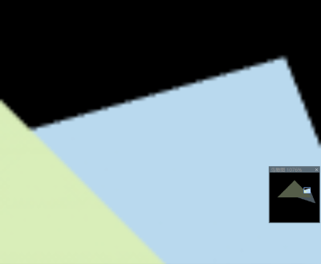

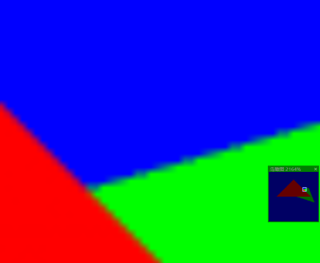


### A3: Fragment Shader

- TBN 矩阵中，增加一步使 t，n正交。

  

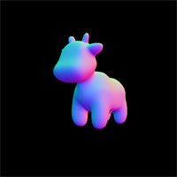

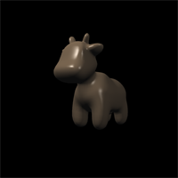

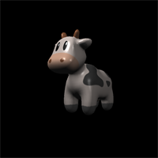

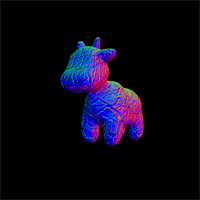

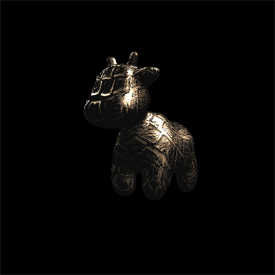

### A4： Bezier Curve

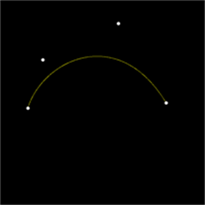

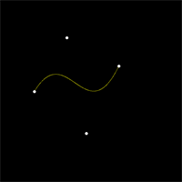

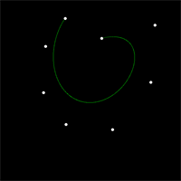

### A5: Ray Tracing

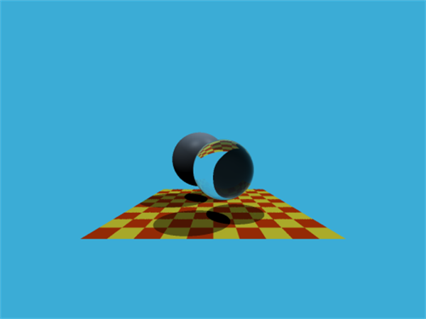


### A6: BVH and SVH

- BVH 可以精确到每个节点中保存一个 obj，但 SVH 不行，因为 SVH 建树时，当 obj 个数为 2-3个时，float 精度已经不支持继续划分，会导致无限递归，因此 SVH 建树可以设节点中最大 obj 数目为5。
- BVH 测试，渲染 bunny 时，当 prims per node  在 5-10 之间时达到最快，渲染速度最快为 16s。根据资料，如果把 最终的 BVH 链表改为数组结构，可能会更快。
- SVH 测试，渲染 bunny 时，当 prims per node  在 5-10 之间时达到最快， 渲染速度最快为 14s，建树速度会随着 num_buckets 增大，明显下降，从 2s 到 4s。
- SVH 参考资料：http://15462.courses.cs.cmu.edu/fall2015/lecture/acceleration

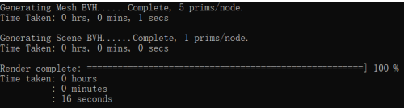

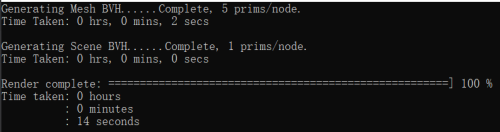

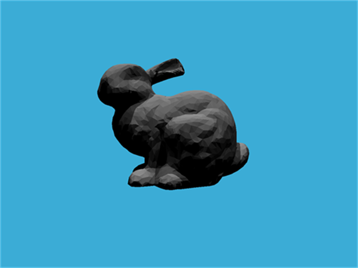

### A7: Path Tracing

- 大幅度修改原来的代码结构，因为很多函数太冗余，如 intersect 函数，明明一个函数就可以解决，偏偏用了 2-3个，且函数命名很混乱。

- 当 t 较大时，注意对 float 有效位的处理，渲染过程中，t 的取值一般都能达到 200 这个级别，而 float 的有效位数为 7 位，因此只能精确到小数点后 4 位，当 EPSILON = 1e-5 时，不能处理点被自身遮挡的情况，因此设 EPSILON = 1e-3

- 包围盒的精度设置，若物体是一个 axis-align 的三角形，若设置包围盒时不特殊处理坐标，则需要求交时改变判断条件为

  ```c++
  if (t_max > EPSILON && t_min < t_max + EPSILON)
  	return true;
  ```

- 通过直接采样光源的光线，可以在使用较少 spp 的情况下，获得较好的结果，Path Tracing 的核心就是蒙特卡洛积分。

- 分辨率对渲染效果影响并没有想象中那么小，重构代码时，我使用 200* 200 像素的图片来测试，但后来发现低分辨率图，只能用于判断渲染的基础逻辑是否正确，不能用于判断渲染的效果，否则，Debug 时会找错原因，比如：

  - 200*200，spp =1 ，直接光照，渲染下图，长立方体正面的像素点的差异清晰可见，一开始我以为是由于bound intersect 逻辑或者 t 的精度判断错误，使得着色点部分被遮挡，但其实是由于分辨率太低、采样点少造成的，因为 light 采样位置是随机的，所以每个像素点之间产生差异是正常的。

  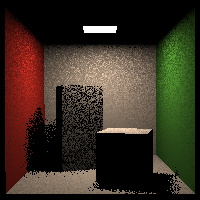

  - 200*200，spp =1 ，全局光照，渲染下图，可以看出图中有很多白色的噪点，一开始我以为是代码逻辑错误，但其实也是由于分辨率太低，采样点太少造成的。代码本身是正确的，上面这两个傻屌问题花了我整整半天。

  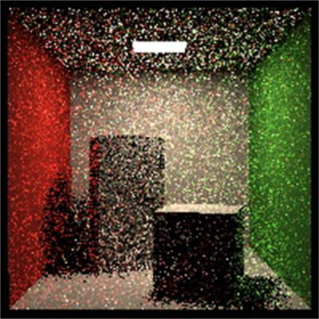

  - 以 1024*1024， spp=16，直接光照，运行 16 分钟。

  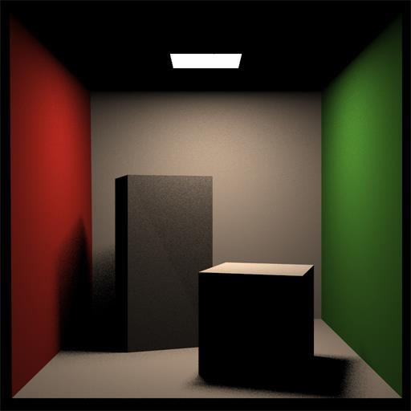

  - 以 1024*1024， spp=16，全局光照，运行 60 分钟。

  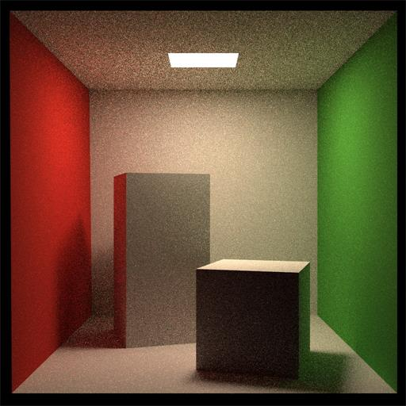

- TODO ：添加微平面